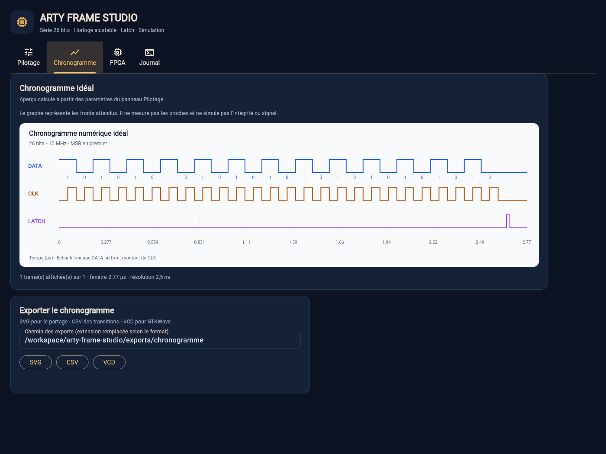

# Arty Frame Studio

Application de bureau **Python / Flet**, en français, pour une **Digilent Arty
A7-100T**, avec pilotage USB/UART, trames série jusqu’à **26 bits**, sorties
**DATA / CLK / LATCH**, simulation et exports de chronogrammes. La compilation
FPGA utilise Yosys, openXC7/nextpnr et Project X-Ray. La programmation SRAM peut
utiliser openFPGALoader ou le backend Windows FTDI D2XX du projet.
Vivado n’est pas utilisé par le projet.

Le PC envoie les paramètres par UART ; le FPGA produit les fronts. La fréquence
réalisable est **200 MHz / N**, N entier de 1 à 65535, soit environ 3,052 kHz à
200 MHz. L’application retient la fréquence réalisable la plus élevée **sans
dépasser** la demande (150 MHz donne 100 MHz) et affiche la valeur obtenue. Les durées latch et
pause sont quantifiées à **2,5 ns**. CLK est émise en rafales, idle bas ; le
destinataire échantillonne DATA au front montant. DATA change au front descendant.

Le firmware fourni a été remplacé par la version corrigée : **RX sur A9,
TX sur D10**, entrées ODDR enregistrées. Remplacer aussi votre ancienne copie
du `.bit`, qui inversait les broches UART et ne pouvait pas répondre à PING.
L'application refuse ce fichier obsolète et vérifie le manifeste du firmware
fourni avant son chargement. Voir [le firmware](firmware/prebuilt/README.md).

Le [firmware précompilé pour le 100T](firmware/prebuilt/arty_frame.bit) est
fourni avec son [manifeste](firmware/prebuilt/firmware-manifest.json) et ses
rapports. La synthèse et le routage libres ont réussi : **Fmax 218,05 MHz,
contrainte 200 MHz respectée** sur les chemins modélisés de `core_clock`.

**Le firmware et ses sorties à 200 MHz n'ont pas encore été testés sur carte.**
Le rapport nextpnr ne certifie pas l'interface DDR ni la liaison Pmod externe.
Voir [le matériel](docs/hardware.md) et [la chaîne FPGA](docs/toolchain.md).



## Démarrage

**Sous Windows :** installer Python 3.11 ou plus récent pour votre compte,
[télécharger le ZIP du dépôt](https://github.com/Citroz31/arty-frame-studio/archive/refs/heads/main.zip),
l'extraire avec son dossier `firmware/prebuilt/`, puis double-cliquer sur
[`start-windows.cmd`](start-windows.cmd). Le lanceur installe les dépendances
dans le dossier du projet. Aucun PowerShell administrateur, WSL, ni changement
de pilote USB n'est demandé. Voir le [guide Windows natif](docs/windows.md).

Depuis un terminal ordinaire Windows, on peut également lancer :

```bat
start-windows.cmd
```

**Sur les autres systèmes :** avec Python 3.11 ou plus récent, depuis ce dossier :

```bash
python -m venv .venv
source .venv/bin/activate
python -m pip install -e '.[dev]'
arty-frame-studio
```

L’interface et le port série fonctionnent sous Windows/macOS/Linux.
Un environnement de bureau est nécessaire pour Flet. Aucun compilateur
FPGA n’est requis pour utiliser la simulation et le mode démonstration.

**Sous Windows, COM7 visible ne signifie pas que le FPGA est programmé.**
Le pilote USB série permet d’ouvrir le port ; le firmware UART du projet doit
être chargé séparément par JTAG. Voir le [guide Windows](docs/windows.md)
si le port est détecté mais ne répond pas.

Avec `uv`, le fichier `uv.lock` permet une installation figée :
`uv sync --extra dev --frozen`, puis `uv run arty-frame-studio`.
Conserver le dossier du projet pour la compilation FPGA. Depuis une installation
wheel séparée, indiquer son emplacement avec `ARTY_FRAME_PROJECT` pour l’interface
ou `--project-root` pour les commandes FPGA de la CLI.

## Utilisation

1. Ouvrir l’application et sélectionner le mode démonstration pour découvrir le
   pilotage sans carte. Saisir la valeur en binaire, hexadécimal ou décimal,
   choisir 1 à 26 bits et régler la fréquence.
2. Définir l’ordre MSB/LSB, la polarité du latch, sa durée, la pause après trame et
   le nombre de répétitions. Le FPGA accepte une seule séquence à la fois ; STOP
   interrompt celle qui est active.
3. Afficher le chronogramme idéal et exporter en SVG, CSV ou VCD (GTKWave). Le
   nombre de répétitions affichées est limité ; cette limite est indiquée sur
   le graphique et s’applique aussi aux exports.
4. Pour la carte réelle sous Windows, utiliser l'onglet **FPGA**, section
   **JTAG Windows natif**. Indiquer `firmware/prebuilt/arty_frame.bit` dans le champ
   **Firmware existant pour l'Arty A7-100T (.bit)**, puis cliquer sur
   **Charger le .bit sous Windows** et attendre environ **30 à 60 secondes**.
   Ce champ est rempli automatiquement lorsque le fichier est présent dans
   le dépôt extrait. La détection JTAG
   seule ne charge rien. Le chargeur utilise le pilote FTDI existant ;
   la procédure détaillée figure dans le [guide Windows](docs/windows.md).
5. Vérifier que la première LED monochrome est allumée, puis choisir
   **Carte · USB / UART**, sélectionner le port de l'Arty et cliquer sur
   **Connecter**. La réponse PING du firmware est vérifiée avant l'envoi
   de trames. Dans la configuration observée, ce port est **COM7**.

La programmation proposée charge la **SRAM volatile** : il faut reprogrammer
après une coupure d’alimentation. Une programmation de la flash n’est pas effectuée.
Les profils sauvegardent les paramètres dans un JSON versionné.

Après un délai dépassé sur SEND ou STOP, l'interface lit STATUS sans répéter
la commande. L'état observé ne prouve pas son exécution : les nouveaux SEND
restent désactivés jusqu'à un STOP confirmé ou une reconnexion explicite.
Les compteurs de diagnostic cumulent les tentatives PING et conservent le
premier aperçu RX.

Le pilote Digilent Adept Runtime, y compris 2.30.4, permet l'accès USB mais
ne charge pas ce firmware. Un IDCODE `0x13631093` confirme l'Arty 100T ;
il ne confirme pas que le protocole UART du projet est exécuté.

La compilation peut être effectuée sur GitHub Actions avec les outils libres
épinglés du projet. Le PC Windows ne fait ensuite que charger le fichier et
envoyer les trames : aucun compilateur FPGA, Linux ou WSL n'y est requis.
Voir [la chaîne et ses rapports](docs/toolchain.md).

## Vérification

```bash
pytest
ruff check src tests
ruff format --check src tests
mypy src/arty_frame_studio
python firmware/sim/run_tests.py
```

La dernière commande nécessite Icarus Verilog. Les tests Python et cinq bancs
RTL couvrent le projet, avec vérification des types et du formatage. Une tâche
GitHub Actions teste aussi le lanceur et le Python sur Windows.
Le projet contient des tests du
protocole et du transport, des chronogrammes et du moteur RTL. Ces tests numériques
ne remplacent pas une mesure à l’oscilloscope sur la carte.

Structure : `src/arty_frame_studio/` contient l’application et la CLI,
`firmware/` le RTL et le brochage, `tests/` les tests, `examples/` les profils,
et `docs/` le protocole et la procédure de compilation.

## Ligne de commande

```bash
arty-frame simulate --profile examples/frame_26bits.json --output exports/trame
arty-frame send --profile examples/frame_26bits.json --demo --wait
arty-frame ports
arty-frame diagnose --port COM7 --timeout 2
arty-frame jtag-devices
arty-frame jtag-diagnose
arty-frame jtag-program --bitstream C:\Arty\arty_frame.bit
arty-frame send --profile examples/frame_26bits.json --port /dev/ttyUSB1 --wait
arty-frame status --port /dev/ttyUSB1
arty-frame stop --port /dev/ttyUSB1
arty-frame doctor --toolchain toolchain.json
arty-frame build --toolchain toolchain.json
arty-frame program --toolchain toolchain.json
```

Exemple de sortie idéale : [chronogramme SVG](examples/chronogramme.svg).
Les broches par défaut sont **JB1 DATA, JB2 CLK, JB3 LATCH**.
Le firmware produit une séquence finie localement ; la vitesse UART ne limite
pas la fréquence de ses fronts. La cadence de nouvelles commandes reste
limitée par la liaison UART.

Licence MIT.
Le pilote et la DLL FTDI D2XX restent des dépendances externes sous licence FTDI.
