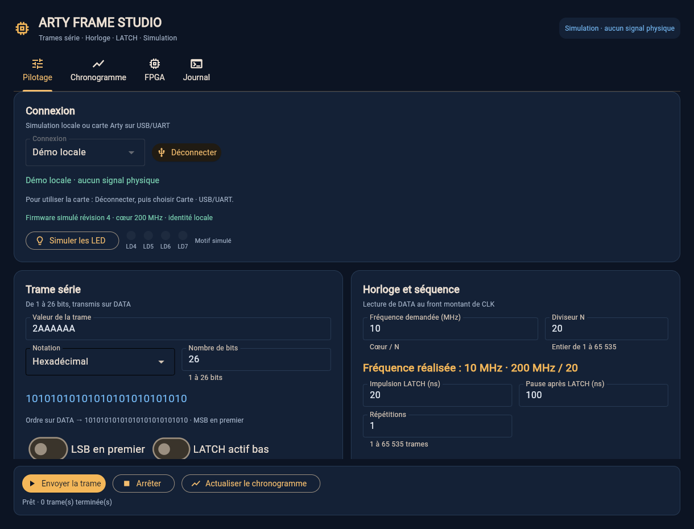

# Arty Frame Studio

Application de bureau **Python / Flet**, en français, pour une **Digilent Arty
A7-100T**, avec pilotage USB/UART, trames série jusqu’à **26 bits**, sorties
**DATA / CLK / LATCH**, simulation et exports de chronogrammes. La compilation
FPGA utilise Yosys, openXC7/nextpnr et Project X-Ray. La programmation SRAM peut
utiliser openFPGALoader ou le backend Windows FTDI D2XX du projet.
Vivado n’est pas utilisé par le projet.

Le PC envoie les paramètres par UART ; le FPGA produit les fronts. Avec le
firmware de référence, la fréquence réalisable est **200 MHz / N**, N entier
de 1 à 65535, soit environ 3,052 kHz à 200 MHz. L’application retient la
fréquence réalisable la plus élevée **sans dépasser** la demande (150 MHz
donne 100 MHz) et affiche la valeur obtenue. Par défaut, CLK est émise en
rafales, au repos bas ; les durées latch et pause sont quantifiées à **2,5 ns**.
Avec **CLK libre entre les trames**, CLK reste périodique pendant toute la
séquence et ces durées sont arrondies à des périodes entières de CLK.
Le destinataire échantillonne DATA au front montant ; DATA change au front descendant.

**Pour commencer : [guide utilisateur et exemple SIPO à 10 MHz](docs/guide-utilisateur-sipo-spi.md).**
Le guide détaille l'installation Windows, le chargement du firmware, le câblage
et les chronogrammes. Deux boutons chargent directement un **exemple SIPO**
ou une **CLK seule à 10 MHz**, sans lancer d'émission.

L'onglet **[Oscilloscope](docs/oscilloscope.md)** affiche DATA et CLK depuis un
**Keysight InfiniiVision** (DSOX1202A) en LAN ou USB, ou en simulation : mesures
de **fréquence et période**, déclenchement, calibres et **Auto scale**,
rafraîchissement **Run / Single** et **curseurs**, avec export CSV.
Les captures de démonstration sont identifiées comme simulées. Après une
perte de synchronisation SCPI, l'application demande une reconnexion plutôt
que de réutiliser une réponse tardive. Voir la
[revue du journal et de l'oscilloscope](docs/review-oscilloscope.md).

Le [récapitulatif des apports de Claude](docs/recapitulatif-claude.md) liste
chaque commit et ce qu'il apporte.

La [revue de la CLK continue](docs/review-clk-continue.md) intègre le firmware
révision 4 de Claude et renforce les contrôles de l'interface, l'arrêt en CLI,
les aperçus et la traçabilité des compilations.

La [revue de la saisie binaire](docs/review-saisie-binaire.md) conserve le
nombre de bits automatique, sécurise les conversions, améliore le
copier-coller et préserve la longueur et la fréquence des profils.

Depuis **Pilotage → Préparer le firmware depuis Pilotage**, l'application
conserve les paramètres de trame et réutilise un `.bit` compatible vérifié.
Changer le mot, le diviseur de CLK, le latch ou les répétitions utilise UART :
cela ne demande pas de recompilation. Pour changer l'**horloge du cœur**
(32 valeurs de 50 à 200 MHz) ou les **broches DATA, CLK et LATCH** sur JA à JD,
elle prépare une compilation locale. Par exemple, une CLK exacte de 150 MHz
demande un cœur à 150 MHz ; le cœur de référence à 200 MHz réalise 100 MHz
pour cette demande.

Sous Windows x64, **Installer les outils Windows locaux** prépare Yosys,
openXC7/nextpnr et Project X-Ray dans votre compte ; **Compiler sur ce PC**
produit ensuite le `.bit` et ses rapports, sans Linux, WSL ni droits
administrateur. Les outils et builds sont conservés sous `%LOCALAPPDATA%`
pour éviter les chemins OneDrive. **Compiler sur GitHub** reste une option.
La préparation ne programme pas la carte et n'envoie pas la trame : charger
le `.bit`, puis connecter l'UART et cliquer sur **Envoyer**. La carte annonce
son horloge et son identifiant de build ; l'application adapte la base de temps.

Le bouton **Tester les LED** fait défiler un chenillard sur les LED vertes
LD4 à LD7 : il confirme d'un coup d'œil que le bon firmware tourne sur la
carte et que la liaison UART fonctionne dans les deux sens.
En mode démo, **Simuler les LED** affiche uniquement des motifs locaux.

La revue du **4 octobre 2026** intègre les ajouts de Claude et améliore
l'interface : paramètres répartis en deux colonnes lorsque la fenêtre le
permet, actions **Envoyer / Arrêter / Chronogramme** toujours visibles,
options avancées repliables et parcours Windows guidé. Les téléchargements
de firmware sont vérifiés avec leurs rapports, puis revérifiés au chargement.
Voir [l'analyse et les améliorations](docs/review-2026-10-04.md).

Le [firmware précompilé pour le 100T](firmware/prebuilt/arty_frame.bit) est
fourni avec son [manifeste](firmware/prebuilt/firmware-manifest.json) et ses
rapports : SHA256, sources exactes, versions des outils et Fmax après routage,
qui doit atteindre 200 MHz sur les chemins modélisés de `core_clock`. Il est
régénéré par le workflow de compilation dès que le RTL change ; l'application
et les tests refusent un `.bit` qui ne correspond plus aux sources. L'ancien
fichier aux broches UART inversées est refusé même renommé.

Un précédent retour utilisateur rapportait un chargement SRAM, le dialogue
UART, le test LED et DATA à **10 MHz**. Le retour plus récent montre DATA sur
JB1 à l'écran du DSOX1202A, mais des délais PING/INFO et un tracé absent dans
l'application. Voir le [diagnostic local](docs/rapport-diagnostic-local.md)
et son [PDF](docs/rapport-diagnostic-local.pdf), qui distinguent ces constats
des corrections et de leurs tests.
**Le dialogue UART actuel, la compilation Windows native et les corrections
SCPI restent à confirmer par les vérifications indiquées dans ce rapport.**
Les sorties à 200 MHz restent à valider physiquement.
Le rapport nextpnr ne certifie pas l'interface DDR ni la liaison Pmod externe.
Voir [le matériel](docs/hardware.md) et [la chaîne FPGA](docs/toolchain.md).



[Chronogramme](docs/images/chronogramme-interface.png) ·
[Interface Oscilloscope](docs/images/oscilloscope-interface.png) ·
[Chargement Windows](docs/images/fpga-interface.png) ·
[Petite fenêtre](docs/images/pilotage-petite-fenetre.png)

## Démarrage

**Sous Windows x64 :** installer Python 3.11 ou plus récent **64 bits** pour votre compte,
[télécharger le ZIP du dépôt](https://github.com/Citroz31/arty-frame-studio/archive/refs/heads/main.zip),
l'extraire avec son dossier `firmware/prebuilt/`, puis double-cliquer sur
[`start-windows.cmd`](start-windows.cmd). Le lanceur installe les dépendances
dans le dossier du projet. Aucun PowerShell administrateur, WSL, ni changement
de pilote USB n'est demandé. Voir le [guide Windows natif](docs/windows.md).

Depuis un terminal ordinaire Windows, on peut également lancer :

```bat
start-windows.cmd
```

**Sur les autres systèmes :** avec Python 3.11 ou plus récent, depuis ce dossier :

```bash
python -m venv .venv
source .venv/bin/activate
python -m pip install -e '.[dev]'
arty-frame-studio
```

L’interface et le port série fonctionnent sous Windows/macOS/Linux.
Un environnement de bureau est nécessaire pour Flet. Aucun compilateur
FPGA n’est requis pour utiliser la simulation et le mode démonstration.

**Sous Windows, COM7 visible ne signifie pas que le FPGA est programmé.**
Le pilote USB série permet d’ouvrir le port ; le firmware UART du projet doit
être chargé séparément par JTAG. Voir le [guide Windows](docs/windows.md)
si le port est détecté mais ne répond pas.

Avec `uv`, le fichier `uv.lock` permet une installation figée :
`uv sync --extra dev --frozen`, puis `uv run arty-frame-studio`.
Conserver le dossier du projet pour la compilation FPGA. Depuis une installation
wheel séparée, indiquer son emplacement avec `ARTY_FRAME_PROJECT` pour l’interface
ou `--project-root` pour les commandes FPGA de la CLI.

## Utilisation

1. Ouvrir l’application et sélectionner le mode démonstration pour découvrir le
   pilotage sans carte. Saisir la valeur, en binaire par défaut : chaque chiffre
   est un bit, **zéros de tête compris**, et le nombre de bits suit la saisie
   (1 à 26). En hexadécimal ou décimal, le nombre de bits se règle à la main.
   Changer de notation convertit une valeur valide en conservant sa longueur.
   Régler ensuite la fréquence.
2. Définir l’ordre MSB/LSB, la polarité du latch, sa durée, la pause après trame et
   le nombre de répétitions, ou activer **Répéter jusqu'à Arrêter** :
   la carte répète alors la trame sans fin (firmware révision 3). **CLK libre entre les trames**
   garde CLK périodique pendant LATCH et la pause (firmware révision 4) ; LATCH
   et pause sont alors arrondis à des périodes entières de CLK. Le FPGA
   accepte une seule séquence à la fois ; **Arrêter** (STOP) interrompt celle
   qui est active.
3. Afficher le chronogramme idéal et exporter en SVG, CSV ou VCD (GTKWave). Le
   nombre de répétitions affichées est limité ; cette limite est indiquée sur
   le graphique et s’applique aussi aux exports.
4. Dans **Pilotage**, **Préparer le firmware depuis Pilotage** vérifie un firmware
   compatible ou le compile localement si l'horloge du cœur ou les broches changent.
   Le firmware de référence suffit à l'exemple 10 MHz et ne demande aucun outil FPGA.
   Pour la carte réelle sous Windows, utiliser ensuite **FPGA**, section
   **1 · Charger le firmware**. Indiquer `firmware/prebuilt/arty_frame.bit` dans le champ
   **Firmware existant pour l'Arty A7-100T (.bit)**, puis cliquer sur
   **Charger le .bit sous Windows** et attendre environ **30 à 60 secondes**.
   Ce champ est rempli automatiquement lorsque le fichier est présent dans
   le dépôt extrait. La détection JTAG
   seule ne charge rien. Le chargeur utilise le pilote FTDI existant ;
   la procédure détaillée figure dans le [guide Windows](docs/windows.md).
5. Vérifier que la première LED monochrome est allumée, puis choisir
   **Carte · USB / UART**, sélectionner le port de l'Arty et cliquer sur
   **Connecter**. PING puis INFO vérifient le dialogue et identifient
   le firmware avant l'envoi de trames. Dans la configuration observée,
   ce port est **COM7**. L'application démarre connectée en démo : cliquer
   d'abord sur **Déconnecter** pour changer de mode.
6. Pour vérifier les sorties, ouvrir l'onglet **Oscilloscope**, connecter le
   Keysight (LAN ou USB) et **Lire l'écran** pour récupérer la trace existante.
   Pour un suivi répétitif, utiliser **Préréglage de la trame**, démarrer Run
   sur l'instrument puis **Run** dans l'application : la fréquence et la période
   de CLK s'affichent sous l'écran. Le Run du PC suit l'état de l'appareil ;
   **Single** demande une nouvelle acquisition. Voir
   [Oscilloscope](docs/oscilloscope.md).

La programmation proposée charge la **SRAM volatile** : il faut reprogrammer
après une coupure d’alimentation. Une programmation de la flash n’est pas effectuée.
Les profils sauvegardent les paramètres, dont la valeur et le nombre de bits,
dans un JSON versionné. Charger un profil ou un exemple conserve la notation
sélectionnée ; en binaire, tous les bits du profil sont affichés, zéros de tête
compris. La notation d'affichage n'est pas enregistrée dans le fichier.

Pour une **CLK indéfinie sans interruption**, activer les **deux options**,
puis cliquer sur **Démarrer CLK continue**. Le firmware doit annoncer les
capacités correspondantes ; sinon le bouton d'envoi reste désactivé.
**Déconnecter ne commande pas STOP** : le FPGA reste autonome.
Le profil [horloge seule à 10 MHz](examples/horloge_seule_10mhz_continue.json)
garde DATA à zéro ; LATCH continue de pulser et peut rester non raccordé.

Pour un **SIPO à capture séparée**, commencer avec
[0xA5 sur 8 bits à 10 MHz](examples/frame_sipo_8bits_10mhz.json), CLK libre
désactivée. En CLK libre, les fronts supplémentaires décalent des zéros pendant
LATCH et la pause : la capture doit être compatible avec ce comportement.
DATA/CLK correspondent à une émission de type SPI mode 0 ; aucun MISO ni CS
dédié n'est implémenté. LATCH ne remplace pas CS.

Après une compilation réussie, son fichier est sélectionné dans les deux
parcours de chargement. **Arrêter** et le suivi UART restent disponibles
pendant une compilation. Une reprogrammation JTAG ferme la liaison UART ;
reconnecter ensuite pour identifier le nouveau firmware. Les réglages de
compilation ne changent pas la carte avant le chargement du résultat.

Après un délai dépassé sur SEND ou STOP, l'interface lit STATUS sans répéter
la commande. L'état observé ne prouve pas son exécution : les nouveaux SEND
restent désactivés jusqu'à un STOP confirmé ou une reconnexion explicite.
Les compteurs de diagnostic cumulent les tentatives PING et conservent le
premier aperçu RX.

Le pilote Digilent Adept Runtime, y compris 2.30.4, permet l'accès USB mais
ne charge pas ce firmware. Un IDCODE `0x13631093` confirme l'Arty 100T ;
il ne confirme pas que le protocole UART du projet est exécuté.

La compilation locale Windows utilise des outils libres épinglés, installés
par **Installer les outils Windows locaux**. Prévoir environ 447 Mo de
téléchargements et au moins 4 Go libres au premier usage. La compilation
GitHub Actions reste facultative ; avec cette option, les outils FPGA ne sont
pas installés sur le PC. Le chargement d'un `.bit` déjà fourni n'exige aucune
chaîne de compilation.
Voir [la chaîne et ses rapports](docs/toolchain.md).

## Vérification

```bash
pytest
ruff check src tests
ruff format --check src tests
mypy src/arty_frame_studio
python firmware/sim/run_tests.py
```

La dernière commande nécessite Icarus Verilog. Les tests Python et six bancs
RTL couvrent le projet, avec vérification des types et du formatage. Une tâche
GitHub Actions teste aussi le lanceur et le Python sur Windows.
Le projet contient des tests du
protocole et du transport, des chronogrammes et du moteur RTL. Ces tests numériques
ne remplacent pas une mesure à l’oscilloscope sur la carte.

Structure : `src/arty_frame_studio/` contient l’application et la CLI,
`firmware/` le RTL et le brochage, `tests/` les tests, `examples/` les profils,
et `docs/` le protocole et la procédure de compilation.

## Ligne de commande

```bash
arty-frame simulate --profile examples/frame_26bits.json --output exports/trame
arty-frame send --profile examples/frame_26bits.json --demo --wait
arty-frame send --profile examples/horloge_seule_10mhz_continue.json --port COM7 --duration 2
arty-frame ports
arty-frame info --port COM7
arty-frame led-test --port COM7
arty-frame install-fpga-tools --project-root .
arty-frame firmware-config --core-mhz 150 --clock JB1 --data JB3 --latch JB7 --output fw.json
ARTY_GITHUB_TOKEN=… arty-frame remote-build --firmware-config fw.json
arty-frame diagnose --port COM7 --timeout 2
arty-frame jtag-devices
arty-frame jtag-diagnose
arty-frame jtag-program --bitstream C:\Arty\arty_frame.bit
arty-frame send --profile examples/frame_26bits.json --port /dev/ttyUSB1 --wait
arty-frame status --port /dev/ttyUSB1
arty-frame stop --port /dev/ttyUSB1
arty-frame doctor --toolchain toolchain.json
arty-frame build --toolchain toolchain.json --firmware-config fw.json
arty-frame program --toolchain toolchain.json
arty-frame scope-list
arty-frame scope --lan 192.168.1.50 --preset --csv exports/mesure.csv
arty-frame scope --demo --profile examples/frame_sipo_8bits_10mhz.json
```

Exemple de sortie idéale : [chronogramme SVG](examples/chronogramme.svg).
Les broches par défaut sont **JB1 DATA, JB2 CLK, JB3 LATCH**.
Le firmware produit la séquence localement, finie ou continue jusqu'à STOP ;
la vitesse UART ne limite pas la fréquence de ses fronts. La cadence de
nouvelles commandes reste limitée par la liaison UART.
En ligne de commande : `arty-frame send --port COM7 --profile trame.json
--continuous` lance l'émission continue, `arty-frame stop --port COM7`
l'arrête ; `--duration 10` envoie STOP après 10 s, `--wait` jusqu'à Ctrl+C.
`--free-clock` ajoute la CLK libre (LATCH et pause du profil arrondis).

Licence MIT.
Le pilote et la DLL FTDI D2XX restent des dépendances externes sous licence FTDI.
