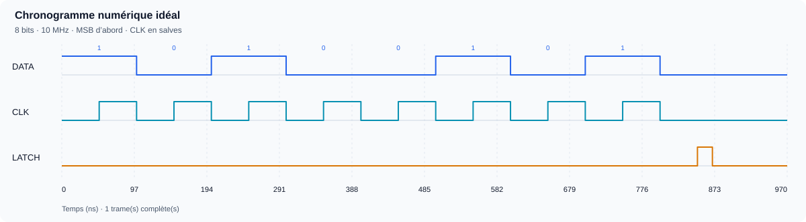
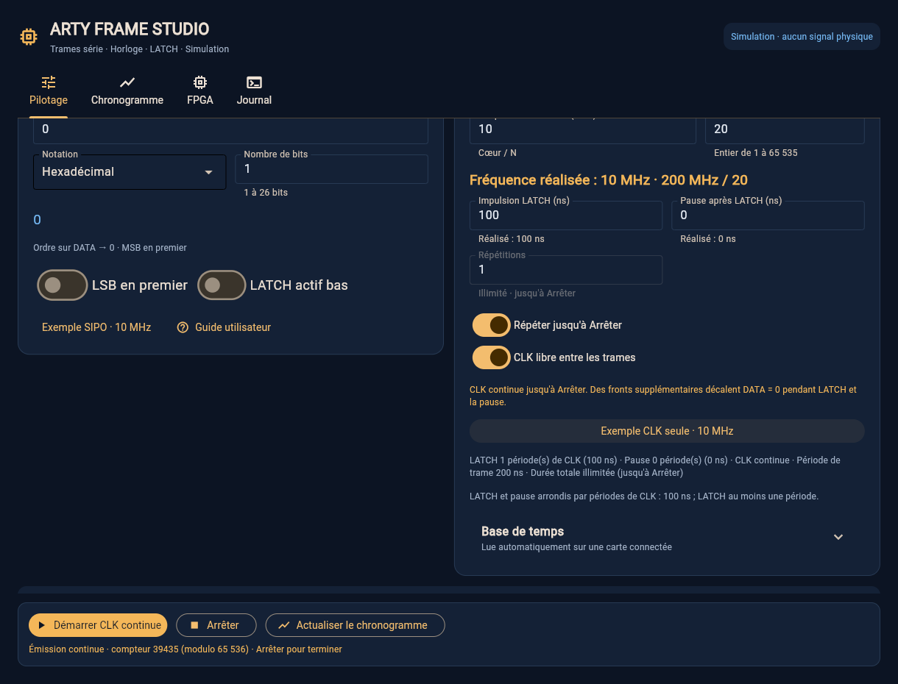

# Guide utilisateur — Arty Frame Studio et SIPO à 10 MHz

Ce guide accompagne l'application **Arty Frame Studio**, en français, pour la
**Digilent Arty A7-100T**. Il permet de préparer une trame, de voir les signaux
attendus puis de les produire sur trois sorties de la carte : **DATA**, **CLK**
et **LATCH**. L'exemple transmet `0xA5`, soit `10100101`, à un registre à décalage
de 8 bits, à **10 MHz**.

Vous pouvez d'abord tout essayer **en démonstration, sans carte ni câblage**.
Sous Windows, le parcours décrit ne nécessite **ni Vivado, ni Linux/WSL, ni
PowerShell administrateur**. Le firmware précompilé est fourni dans le dépôt.

## 1. Comprendre les quatre éléments

| Élément | Son rôle |
| --- | --- |
| Application sur le PC | Préparer les paramètres, les envoyer et afficher un chronogramme idéal. |
| Firmware `.bit` | Configurer le FPGA pour qu'il comprenne l'application et produise les signaux. |
| JTAG | Charger ce firmware dans le FPGA. Détecter le FPGA par JTAG ne charge rien. |
| USB/UART, par exemple COM7 | Communiquer avec le firmware une fois chargé. |

La carte produit elle-même les fronts de CLK. La vitesse du port COM ne limite
donc pas les **10 MHz** de l'exemple. Le PC envoie une commande de configuration,
puis le FPGA exécute la trame.

**SIPO** signifie « entrée série, sorties parallèles ». Une entrée reçoit les
bits un par un ; les sorties représentent ensuite le mot reçu. L'exemple vise
un SIPO qui **décale sur le front montant de CLK** et possède un **registre de
sortie séparé, capturé sur le front montant de LATCH**.

Le signal DATA joue ici le rôle de **MOSI** et CLK celui de **SCK**. La trame
utilise une horloge au repos bas et une lecture au front montant : le
comportement des données correspond au **mode SPI 0**. L'application réalise
une émission série ; elle n'implémente pas un contrôleur SPI complet :

- aucune lecture MISO ni échange en duplex ;
- aucun signal CS dédié encadrant la transmission ;
- aucun choix des autres modes SPI, ni séquence automatique « adresse puis
  lecture ».

**LATCH ne remplace pas CS.** Si votre puce exige CS bas avant le premier bit
et haut après le dernier, ou un protocole spécifique, cet exemple ne suffit
pas. Vérifiez les diagrammes de sa fiche technique avant le branchement.

## 2. Installer et découvrir le programme sous Windows

1. Installer **Python 3.11 ou plus récent**, pour votre compte utilisateur.
   Activer l'ajout de Python au PATH si l'installateur le propose.
2. [Télécharger le ZIP du projet](https://github.com/Citroz31/arty-frame-studio/archive/refs/heads/main.zip).
3. Extraire tout le ZIP dans un dossier accessible, par exemple
   `C:\Users\VotreNom\Documents\arty-frame-studio`. Conserver notamment les
   dossiers `firmware`, `examples` et `src`. Ne pas lancer depuis le ZIP.
4. Double-cliquer sur **`start-windows.cmd`**. Au premier lancement, il crée
   l'environnement Python et installe les dépendances ; une connexion Internet
   est nécessaire. Les installations sont placées dans le dossier du projet.
5. L'application démarre connectée à une **démo locale**. Aucun signal n'est
   produit sur la carte dans ce mode.

Les quatre onglets sont :

| Onglet | Quand l'utiliser |
| --- | --- |
| **Pilotage** | Connexion, contenu de la trame, fréquence, LATCH, répétitions et arrêt. |
| **Chronogramme** | Voir les transitions idéales et exporter le graphique ou les données. |
| **FPGA** | Charger le firmware ; personnalisation et compilation facultatives. |
| **Journal** | Retrouver les commandes, réponses et erreurs ; exporter un diagnostic. |

Dans **Pilotage**, préparez les paramètres puis cliquez sur **Actualiser le
chronogramme**. **Envoyer la trame**, en démo, simule aussi une émission et son
état. Cela n'établit aucune communication avec une vraie carte.

Après une mise à jour, extraire la nouvelle version dans un nouveau dossier
évite de mélanger des fichiers de versions différentes. Si vous réutilisez le
dossier existant, `start-windows.cmd --setup-only`, depuis un terminal Windows
ordinaire, actualise les dépendances.

## 3. Préparer la vraie carte : firmware puis port COM

Conserver le pilote **Digilent Adept Runtime / FTDI** déjà installé. Le pilote
permet l'accès USB ; il ne charge pas le firmware de cette application.
Le parcours Windows natif n'exige pas de remplacement du pilote avec Zadig.

1. Relier l'Arty au connecteur **USB PROG/UART**, avec un câble USB permettant
   les données. Fermer les autres logiciels utilisant le JTAG ou le port COM.
2. Dans **Pilotage**, cliquer sur **Déconnecter** pour quitter la démo.
3. Ouvrir **FPGA → 1 · Charger le firmware**. Le fichier fourni
   `firmware\prebuilt\arty_frame.bit` doit être sélectionné. Au besoin, utiliser
   **Utiliser le firmware fourni** ou le bouton de parcours.
4. **Détecter le FPGA sous Windows** vérifie que l'Arty 100T est reconnue.
   Cliquer ensuite sur **Charger le .bit sous Windows**, puis attendre la
   confirmation du chargement dans le journal. Prévoir environ 30 à 60 secondes.
   Garder le dossier `firmware/prebuilt/` complet : les rapports accompagnent
   le fichier et permettent sa vérification.
5. Revenir dans **Pilotage**, choisir **Carte · USB / UART**, actualiser les
   ports puis sélectionner celui de l'Arty. **COM7 est un exemple**, pas une
   valeur obligatoire : le numéro varie selon le PC.
6. Cliquer sur **Connecter**. Le programme teste le dialogue puis identifie
   le firmware. Pour utiliser toutes les options de ce guide, vérifier
   **révision 4**, **cœur 200 MHz** et le brochage de référence.
7. Cliquer sur **Tester les LED** : les LED vertes LD4 à LD7 doivent défiler.
   Ce test confirme le dialogue UART avec le firmware de la carte.

Le chargement est effectué dans la **SRAM volatile**. Après une coupure
d'alimentation, **recharger le `.bit`**, puis reconnecter l'UART. La détection
JTAG et la présence de COM7 ne prouvent pas que ce firmware est chargé.

Les réglages de fréquence dans Pilotage n'exigent pas une nouvelle compilation.
Pour cet exemple à 10 MHz, le firmware fourni à cœur 200 MHz suffit. La
personnalisation du firmware est utile pour changer les broches ou l'horloge
de cœur ; elle est facultative pour commencer.

## 4. Câbler un SIPO : exemple de type 74HC595

Faire le câblage **hors tension**. Les sorties de l'Arty utilisent des niveaux
**3,3 V**. Les masses de la carte et du circuit récepteur doivent être reliées.
Vérifier l'orientation du Pmod et les numéros physiques sur la carte.

| Arty, firmware de référence | À relier à l'entrée du SIPO | Rôle |
| --- | --- | --- |
| **JB1**, FPGA E15 — DATA | Entrée série DS / SER / MOSI | Les bits du mot. |
| **JB2**, FPGA E16 — CLK | Horloge de décalage SHCP / SRCLK / SCK | Lecture de DATA au front montant. |
| **JB3**, FPGA D15 — LATCH | Horloge du registre de sortie STCP / RCLK | Capture du mot reçu au front montant. |
| **JB5 ou JB11** — GND | GND | Masse commune. |

Les noms des entrées varient selon les fabricants. Les broches de boîtier
doivent être lues dans la fiche technique de **votre référence exacte**.
JB6 et JB12 sont des alimentations 3,3 V, pas des sorties programmables.

Pour un composant de type **74HC595** :

- prévoir une alimentation et un découplage adaptés, par exemple 3,3 V avec
  un condensateur de 100 nF au plus près du composant ; vérifier son datasheet ;
- maintenir l'effacement actif bas, généralement `/MR` ou `/SRCLR`, **haut** ;
- maintenir l'activation des sorties, généralement `/OE`, **basse** si les
  sorties doivent être actives ;
- vérifier que la variante choisie accepte **10 MHz à 3,3 V**, ainsi que les
  temps de préparation, maintien et impulsion de LATCH utilisés ci-dessous.

Le nom « 74HC595 » seul ne garantit pas ces conditions pour tous les fabricants,
charges et températures. Alimenter un récepteur à 5 V peut rendre un niveau
haut de 3,3 V insuffisant ; utiliser une adaptation de niveau si nécessaire.
Ne pas raccorder un signal 5 V directement à une broche de l'Arty.

Pour les premiers essais, utiliser des fils courts et commencer à **1 MHz**,
puis passer à 10 MHz après vérification. Des LED sur les sorties parallèles
nécessitent chacune une résistance et le respect du courant admissible du
composant ; elles ne doivent pas être branchées directement.

## 5. Envoyer `0xA5` à 10 MHz, une seule fois

### Saisir la trame : binaire par défaut

Dans **Pilotage → Trame série**, la notation proposée est **Binaire** : vous
tapez directement les bits, dans l'ordre où ils s'écrivent, le bit de poids fort
(MSB) à gauche.

- **Chaque chiffre est un bit.** Le champ **Nombre de bits** se met à jour à
  chaque chiffre ajouté ou retiré ; il n'est pas modifiable dans cette notation.
  Saisir au moins un bit : une valeur vide ne peut pas être envoyée.
- **Les zéros de tête comptent** : `00000101` est une trame de 8 bits, alors
  que `101` n'en fait que 3. Tapez tous les bits attendus par le récepteur.
- **Espaces et `_` servent seulement à grouper** : `1010 0101` ou `1010_0101`
  donnent les mêmes 8 bits. Le préfixe `0b` est accepté et ne compte pas.
- **26 bits maximum par trame.** Au 27ᵉ chiffre, le message « 27 bits saisis :
  26 bits maximum par trame » apparaît et l'envoi est désactivé jusqu'à ce
  que vous retiriez un chiffre. Un caractère autre que 0, 1, espace ou `_`
  est également signalé, sauf le préfixe `0b` au début.

Les notations **Hexadécimal** et **Décimal** restent disponibles. Le champ
**Nombre de bits** redevient alors réglable à la main, de 1 à 26 : la valeur
doit y tenir, et les bits manquants à gauche sont des zéros. Le nombre de
chiffres hexadécimaux ou décimaux ne fixe pas la longueur. Changer de
notation convertit une valeur valide **sans changer la longueur** :
`00010100101` (11 bits) devient `A5` en hexadécimal ou `165` en décimal,
toujours avec 11 bits, puis de nouveau `00010100101` en binaire.
Corriger une saisie invalide avant de changer de notation ; effacer le champ
permet de choisir une autre notation avant de saisir une nouvelle valeur.

Charger un profil ou un exemple conserve la notation sélectionnée et applique
le nombre de bits du profil. En binaire, la valeur affiche tous ces bits,
zéros de tête compris ; en hexadécimal ou décimal, sa longueur reste indiquée
dans **Nombre de bits**. Le fichier JSON enregistre la valeur et la longueur,
pas la notation d'affichage.

L'option **LSB en premier** ne change pas la saisie : elle inverse l'ordre
d'émission. La ligne **Ordre sur DATA**, sous la valeur, montre les bits dans
l'ordre réellement envoyé.

### Paramètres de l'exemple

Vous pouvez saisir les paramètres ci-dessous ou charger le profil fourni :
**[frame_sipo_8bits_10mhz.json](../examples/frame_sipo_8bits_10mhz.json)**.
Dans **Pilotage → Profils de trame**, parcourir jusqu'à ce fichier puis cliquer
sur **Charger le profil**. Le fichier doit provenir du dossier extrait du ZIP.
Vous pouvez aussi cliquer directement sur **Exemple SIPO · 10 MHz**, dans
**Trame série** : le bouton remplit les paramètres et le chronogramme sans
envoyer de signaux. Vérifier les réglages, puis cliquer sur Envoyer lorsque
la carte et le câblage sont prêts.

| Paramètre de Pilotage | Valeur | Sens |
| --- | --- | --- |
| Notation | **Binaire** (par défaut) | Les bits se tapent tels quels. |
| Valeur de la trame | `10100101` (ou `1010 0101`) | `0xA5`, soit 165 en décimal. |
| Nombre de bits | **8**, calculé automatiquement | Huit chiffres saisis, zéros compris. |
| LSB en premier | **Désactivé** | Bit de poids fort d'abord : `1 0 1 0 0 1 0 1`. |
| Fréquence demandée | **10 MHz** | Une période de CLK vaut 100 ns. |
| Diviseur N | **20** | Cœur 200 MHz ÷ 20 = 10 MHz. |
| Impulsion LATCH | **20 ns** | Impulsion haute après les huit bits. |
| LATCH actif bas | **Désactivé** | Le front montant capture le mot. |
| Pause après LATCH | **100 ns** | Repos avant une éventuelle répétition. |
| Répétitions | **1** | Une trame puis arrêt automatique. |
| Répéter jusqu'à Arrêter (émission continue) | **Désactivé** | Aucune répétition indéfinie. |
| CLK libre entre les trames | **Désactivée** | Exactement huit impulsions par trame. |

La **fréquence obtenue** affichée doit être 10 MHz. Pour les autres valeurs,
le diviseur entier peut imposer une fréquence plus basse que la demande.
Avec le firmware fourni, les durées sont arrondies par pas de 2,5 ns ; 20 ns
et 100 ns sont donc représentables exactement.

En hexadécimal, saisir `A5` ou `0xA5` et régler **Nombre de bits** sur **8**
donne la même trame. En décimal, saisir `165` avec **8** bits.

Cliquer sur **Actualiser le chronogramme**, puis sur **Envoyer la trame**.
Le FPGA présente le premier bit avant le premier front montant. La référence
de temps ci-dessous correspond au début des signaux, après la réception de
la commande ; elle n'inclut pas la latence USB/UART.

| Temps depuis le début | Ce qui se passe |
| --- | --- |
| **0 ns** | DATA = 1, CLK = 0, LATCH = 0. |
| **50, 150, 250, 350, 450, 550, 650, 750 ns** | Huit fronts montants : lecture de `1 0 1 0 0 1 0 1`. |
| **100, 200, …, 700 ns** | Fronts descendants : préparation du bit suivant. |
| **800 ns** | Dernier front descendant ; DATA revient à 0, CLK reste basse. |
| **850 ns** | LATCH monte, 50 ns après le dernier front descendant ; le mot est capturé. |
| **870 ns** | LATCH redescend après son impulsion de 20 ns. |
| **970 ns** | Fin de la pause de 100 ns et de la trame. |



Un SIPO à registre de sortie séparé conserve ensuite le mot sur ses sorties
parallèles, même si DATA revient à zéro. Sur un 74HC595 avec les sorties nommées
QA à QH et le bit de poids fort envoyé d'abord, le mot lu **QH…QA** vaut
`10100101`. Vérifier le nom et l'ordre des sorties dans le datasheet.
Le délai de propagation réel vers ces sorties n'est pas modélisé.

Une trame de 970 ns est trop courte pour voir son passage à l'œil sur les LED
d'état de la carte. Observer les sorties du SIPO ou utiliser un oscilloscope /
analyseur logique adapté. Pour cette configuration, compter **huit fronts
montants de CLK**, vérifier le mot puis l'impulsion LATCH. Une répétition rapide
de la même valeur laisse également les sorties parallèles inchangées.

Pour une puce différente, remplacer la valeur et la longueur, puis adapter
LATCH et pause à sa fiche technique. Le programme transmet de **1 à 26 bits**
par trame. Trois registres de 8 bits chaînés peuvent tenir dans une trame de
24 bits ; quatre registres de 8 bits exigent 32 bits et dépassent cette limite.

## 6. Répéter une trame ou faire tourner CLK sans interruption

Les options **Répéter jusqu'à Arrêter** et **CLK libre entre les trames**
répondent à des besoins différents :

| Émission continue | CLK libre | Résultat |
| --- | --- | --- |
| Désactivée | Désactivée | Nombre fixé de trames ; CLK pulse uniquement pendant les bits. |
| Activée | Désactivée | Trame répétée jusqu'à **Arrêter**, avec CLK basse pendant LATCH et pause. |
| Désactivée | Activée | Nombre fixé de trames ; CLK tourne aussi pendant LATCH et pause, puis s'arrête. |
| Activée | Activée | CLK périodique et trame répétée indéfiniment jusqu'à **Arrêter**. |



### Répétition recommandée pour le SIPO

Pour répéter l'exemple sans fin, activer **Répéter jusqu'à Arrêter** (émission continue)
et laisser **CLK libre désactivée**. Le champ Répétitions devient inactif.
Le profil prêt à charger est
**[frame_sipo_8bits_10mhz_continu.json](../examples/frame_sipo_8bits_10mhz_continu.json)**.

Chaque trame dure toujours 970 ns et contient huit impulsions, puis LATCH et
la pause. La fréquence **des impulsions** est 10 MHz ; cela ne signifie pas
10 millions de trames par seconde. Ici, environ 1,03 million de trames sont
répétées par seconde. Le compteur affiché reboucle à 65 536 ; ce n'est pas un
total cumulatif pour une émission illimitée.

### CLK libre : option pour un récepteur compatible

Avec **CLK libre**, CLK reste périodique pendant toute l'émission, y compris
pendant LATCH et la pause. Pour garder les trames en phase, leurs durées sont
arrondies à des **périodes entières de CLK**. À 10 MHz :

- LATCH dure au moins **100 ns** ; une demande de 20 ns devient 100 ns ;
- une pause demandée de 100 ns reste 100 ns ;
- LATCH monte au dernier front descendant des bits, à **800 ns**, puis
  redescend à 900 ns ; la trame suivante commence à 1 000 ns ;
- CLK a aussi des fronts montants à **850 et 950 ns**, avec DATA = 0.

La trame dure donc **1 000 ns** et contient dix périodes de CLK : huit pour les
bits, une pour LATCH et une pour la pause. Le profil JSON utilise
`repeat_count: 0`, `free_clock: true`, `divider: 20`, `latch_ticks: 20` et
`gap_ticks: 40`. En CLK libre, le champ interne `latch_ticks` ne représente pas
seul l'impulsion visible ; le profil fourni effectue cette conversion.

Le profil
**[frame_sipo_8bits_10mhz_clk_libre.json](../examples/frame_sipo_8bits_10mhz_clk_libre.json)**
montre ce fonctionnement avec répétition indéfinie. Il est fourni pour
**étudier cette option**, et ne remplace pas le profil recommandé ci-dessus.

**Un SIPO décale à chaque front montant, y compris ces fronts supplémentaires.**
Son registre de décalage reçoit alors des zéros après le mot. Un composant à
registre de sortie séparé, capturé seulement sur le front montant de LATCH,
peut conserver le mot capturé ; un composant à latch transparent, à autre front
de capture ou sans registre séparé peut se comporter différemment.

Avec LATCH actif haut, le front montant à **800 ns** capture encore `0xA5`.
Si vous choisissez LATCH actif bas alors que le composant capture toujours au
front montant, il capture à la **fin** de l'impulsion, à 900 ns : un zéro a déjà
été décalé à 850 ns. Le mot peut donc être différent. La polarité doit
correspondre au fonctionnement réel du récepteur.

Utiliser CLK libre uniquement si le récepteur accepte ces fronts et ce timing.
Pour une puce SPI attendant exactement huit fronts sous CS, garder CLK en
rafales et prévoir une implémentation de CS adaptée à son protocole.
L'option CLK libre ne crée pas une sortie d'horloge indépendante de DATA/LATCH :
elle fait partie de la séquence envoyée.

### Utiliser uniquement une horloge continue à 10 MHz

Si vous avez besoin d'une **horloge seule**, sans transmettre de mot au SIPO,
charger le profil
**[horloge_seule_10mhz_continue.json](../examples/horloge_seule_10mhz_continue.json)**.
Le bouton **Exemple CLK seule · 10 MHz**, dans **Horloge et séquence**, prépare
ces mêmes réglages **sans envoyer de signaux**.
Il active la répétition indéfinie et CLK libre avec une valeur de zéro sur un
bit, N = 20, une période de LATCH et aucune pause.

Relier uniquement **JB2/CLK** et **JB5 ou JB11/GND** au récepteur compatible
3,3 V. DATA reste à zéro. LATCH continue à pulser, mais peut rester **non
raccordé** s'il n'est pas utile. Ce profil utilise le moteur de trame existant,
sans nouvelle compilation et sans supposer un signal CS.

Cliquer sur **Envoyer la trame** : CLK devient périodique à 10 MHz, puis continue
jusqu'à **Arrêter**, un reset ou une coupure d'alimentation. **Elle ne tourne
pas avant l'envoi**, lorsqu'aucune séquence n'est active. Le compteur affiché
compte des **trames** : ici, chacune dure deux périodes de CLK (un bit et une
période de LATCH). Il reboucle à 65 536 et ne mesure pas une durée.

### Arrêter avant de déconnecter

Cliquer sur **Arrêter** et attendre la confirmation **STOP / prêt**. Le FPGA
ramène CLK et DATA à zéro et LATCH à son niveau inactif. Une trame interrompue
peut être incomplète ; STOP ne garantit pas l'achèvement du mot en cours et
n'est pas un arrêt d'urgence instantané du circuit externe.

**Déconnecter, fermer la fenêtre ou fermer le port COM n'envoie pas
automatiquement STOP.** Une émission continue peut rester active sur la carte.
Reconnecter puis cliquer sur Arrêter ; si le dialogue est indisponible, le
bouton RESET de la carte ou la coupure d'alimentation arrête le moteur.
Le reset peut également affecter le circuit externe : ne pas le traiter comme
une impulsion LATCH normale.

Si SEND ou STOP expire, l'application lit l'état sans renvoyer aveuglément la
commande. L'état peut rester incertain : attendre un **STOP confirmé** avant
d'envoyer une nouvelle trame. Changer les paramètres à l'écran ou actualiser
le chronogramme ne modifie pas une émission déjà lancée : Arrêter, puis Envoyer
avec les nouveaux réglages.

### Facultatif : limiter l'émission depuis un terminal Windows

Depuis un terminal ordinaire ouvert dans le dossier du projet, cette commande
lance l'horloge seule puis demande son arrêt après environ deux secondes :

```bat
.venv\Scripts\arty-frame.exe send --profile examples\horloge_seule_10mhz_continue.json --port COM7 --duration 2
```

Remplacer COM7 par le port de la carte. `--duration` est un temporisateur
**sur le PC**, soumis à la latence UART ; ce n'est pas une durée matérielle
exacte. Ctrl+C tente aussi d'envoyer une commande STOP. Si la liaison est
perdue, l'arrêt ne peut pas être garanti : reconnecter puis utiliser
`.venv\Scripts\arty-frame.exe stop --port COM7`, ou RESET si nécessaire.

## 7. Lire et exporter le chronogramme

L'onglet **Chronogramme** affiche DATA, CLK et LATCH. Il calcule les transitions
attendues à partir des paramètres de Pilotage ; **ce n'est pas une mesure de
la carte**. Il ne représente pas les temps de montée, le bruit, les délais de
câblage ou le délai interne de votre SIPO.

Pour une émission continue, l'aperçu affiche une **fenêtre finie**, généralement
les quatre premières trames. En CLK libre, une limite de **50 000 transitions**
conserve un affichage utilisable. Une première trame très longue peut donc
donner **zéro trame complète et une trame partielle**. Le texte de l'aperçu
indique cette limite. La fin du graphique ne signifie pas que la carte s'arrête.

Dans **Exporter le chronogramme**, choisir le chemin puis le format :

| Format | Utilisation |
| --- | --- |
| SVG | Image vectorielle, lisible dans un navigateur et réutilisable dans un document. |
| CSV | Tableau des instants de transition et des niveaux ; ce ne sont pas des échantillons uniformes. |
| VCD | Analyse des transitions dans un visualiseur comme GTKWave. |

**Les exports contiennent la même fenêtre finie que la simulation**, pas toute
une émission indéfinie. Pour valider le câblage et le composant, comparer cette
simulation à une capture réelle de CLK, DATA et LATCH.

## 8. Mesurer les signaux avec l'oscilloscope

L'onglet **Oscilloscope** pilote un Keysight InfiniiVision, par exemple un
**DSOX1202A**, en **LAN** (adresse IP, port 5025, aucun logiciel à installer)
ou en **USB** (Keysight IO Libraries Suite). Le choix **Simulation (démo)**
montre les signaux de la trame du Pilotage sans appareil.

1. Relier la sonde CH1 à **JB1 (DATA)**, la sonde CH2 à **JB2 (CLK)** et leurs
   masses à **JB5 ou JB11**, avec le **ressort de masse court**. Mettre les
   sondes en **×10** et régler **Sonde 10:1** sur chaque voie.
2. Choisir la liaison, saisir l'adresse (ou **Rechercher** en USB), puis
   **Connecter**. Cliquer sur **Préréglage de la trame** : 1 V/div, DATA en
   haut, CLK en bas, cinq périodes de CLK, déclenchement sur CLK à 1,65 V.
3. **Single** fait une acquisition, **Run** rafraîchit en continu à la cadence
   choisie, **Stop** arrête. **Auto scale** convient à un signal inconnu.
4. Lire la **fréquence** et la **période** de CLK sous l'écran. Avec `1010…`,
   DATA change tous les 100 ns à 10 MHz : sa fréquence affichée vaut 5 MHz.
5. Pour une mesure manuelle, choisir des **curseurs**, puis **Mesurer une
   période** : ΔX et 1/ΔX s'affichent. Les curseurs se déplacent aussi en
   cliquant ou en glissant sur l'écran.

Des tensions dix fois trop grandes (par exemple **66 V crête à crête** pour une
sortie de 3,3 V) viennent d'un facteur de sonde différent entre la sonde et la
voie ; des pics à chaque front, d'un long fil de masse. L'onglet signale ces
deux cas. Le détail des réglages, de l'export CSV et de la ligne de commande
figure dans [Oscilloscope](oscilloscope.md).

## 9. Résoudre les difficultés fréquentes

| Observation | Action suivante |
| --- | --- |
| JTAG reconnaît l'Arty, mais PING expire | Charger le `.bit` fourni, puis vérifier le port UART ; une détection JTAG seule ne suffit pas. |
| COM7 absent ou occupé | Actualiser les ports, vérifier USB PROG/UART et fermer tout autre terminal série. Le numéro peut avoir changé. |
| Firmware ancien, option continue / CLK libre indisponible | Charger le firmware à jour, puis déconnecter/reconnecter pour relire sa révision. |
| UART répond mais rien ne change sur le SIPO | Vérifier le mode Carte, la masse, l'alimentation, le brochage, l'ordre des bits, `/OE`, `/MR` et l'impulsion LATCH. |
| Le mot est faux avec CLK libre | Revenir au mode en rafales ; compter les fronts et vérifier le type de capture du latch. |
| Le mot est correct lentement mais faux à 10 MHz | Vérifier les limites du datasheet, les fils et les temps setup/hold à l'oscilloscope ; réduire la fréquence. |
| Envoyer est désactivé | Vérifier les paramètres et l'état : connecter, arrêter une émission active ou résoudre une commande non confirmée. |
| « 26 bits maximum par trame » | Retirer des chiffres de la valeur binaire ; espaces et `_` ne comptent pas. |
| Nombre de bits impossible à modifier | En binaire, il suit la saisie : ajouter ou retirer des chiffres, y compris des zéros de tête. Passer en hexadécimal ou décimal pour le régler à la main. |
| Le récepteur reçoit des bits décalés | Vérifier que tous les zéros de tête sont saisis : la longueur de la trame est celle de la saisie binaire. |
| La carte continue après fermeture | Reconnecter puis Arrêter ; RESET ou coupure si la liaison ne fonctionne plus. |
| « Chaîne FPGA locale non configurée » dans le journal | Sous Windows, charger le firmware avec **Charger le .bit sous Windows** et compiler avec **Compiler sur GitHub** ; la chaîne locale sert sous Linux/WSL. |
| Avertissement OneDrive ou chemin long au démarrage | Extraire le projet dans un dossier local court, par exemple `C:\ArtyFrameStudio`. |
| Mesure à l'oscilloscope dix fois trop grande | Accorder le commutateur ×1/×10 de la sonde et le réglage **Sonde** de la voie. |

En cas d'erreur persistante, ouvrir **Journal**, exporter le fichier et conserver
le message exact, le port COM, la révision du firmware et le profil utilisé.
La validation numérique du projet ne remplace pas la vérification physique
du chargement et des signaux sur votre carte.

## Pour aller plus loin

- [Guide Windows et diagnostics détaillés](windows.md)
- [Oscilloscope : mesures, déclenchement, curseurs](oscilloscope.md)
- [Brochage et caractéristiques électriques](hardware.md)
- [Compilation d'un firmware personnalisé](toolchain.md)
- [Format des commandes UART](protocol.md)
- [Dépôt et dernière version](https://github.com/Citroz31/arty-frame-studio)

Le guide vise le firmware de référence **révision 4, cœur 200 MHz**. Avec un
firmware personnalisé, l'application lit l'horloge réelle et adapte les
paramètres ; vérifier à nouveau la fréquence obtenue, les durées et le brochage
avant de reproduire l'exemple.
