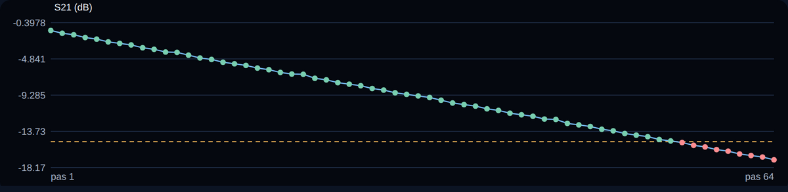

# Mode mesure : une suite de mots, une validation après chacun

L'onglet **Mesure** envoie à la suite les mots d'une liste (par exemple
`000000000000000000000000`, puis `000000000000000000000001`, puis
`000000000000000000000010`…), **attend une validation après chacun**, puis passe
au suivant. La validation peut venir de vous, de l'**oscilloscope** de l'onglet
Oscilloscope ou d'un **instrument SCPI** tel qu'un analyseur de réseau vectoriel
(VNA). Chaque mot, son statut et les valeurs mesurées sont notés dans un tableau,
un graphique et un fichier CSV.

C'est le mode prévu pour caractériser un composant à commande série (DATA, CLK,
LATCH) : parcourir tous ses codes, ou un bit à la fois, en relevant à chaque
étape une grandeur.



## 1. Principe

1. Dans **Pilotage**, régler la trame du composant : fréquence de CLK, ordre des
   bits (MSB/LSB), polarité et durée de LATCH. Connecter la carte (ou la démo).
2. Dans **Mesure**, choisir les mots, ce qui valide chacun, puis **Démarrer**.
3. Pour chaque mot, l'application envoie la trame, **attend la fin de son émission**,
   laisse passer l'**attente de stabilisation**, puis déclenche la validation.
4. Le balayage continue, ou s'arrête sur une erreur, un échec (si demandé) ou
   votre demande. **Reprendre** repart au mot suivant.

Seule la **valeur** change d'un mot à l'autre : tous les autres réglages viennent
du Pilotage. Chaque mot est une trame **finie** : l'émission continue et le nombre
de répétitions du Pilotage ne s'appliquent pas, il y a **une trame par mot**
(ou le nombre choisi dans « Répétitions par mot »). Pendant un balayage, l'envoi
manuel, la connexion UART et les réglages de l'oscilloscope sont verrouillés.

## 2. Choisir les mots

| Mode | Contenu |
| --- | --- |
| **Liste de mots** | Un mot par ligne (ou séparés par espaces, virgules, points-virgules). Base binaire par défaut ; préfixe `0x` ou `0b` pour forcer la base d'un mot. |
| **Compteur** | De *début* à *fin* inclus, avec un *pas* décimal : `0`, `1`, `10`, `11`… |
| **Liste d'états** | Un état par ligne : `mot ; TR ; nom`, chargé depuis un fichier ou saisi. Voir [le mode VNA](mode-vna.md). |
| **Un seul bit à 1** | `0…001`, `0…010`, `0…100`… Le bit parcourt le mot, du poids faible au poids fort. |
| **Un seul bit à 0** | Le complément : un zéro dans des uns. |

**Largeur.** Elle est **déduite** de la liste si tous les mots sont binaires de
même longueur : 24 chiffres donnent des trames de 24 bits, même si le Pilotage est
réglé sur 26. Sinon c'est la largeur du Pilotage. Le champ « Largeur (bits) »
l'impose (1 à 26). Les zéros de tête comptent comme dans le Pilotage. Un mot plus
large que la trame est refusé avec son texte.

L'aperçu indique le nombre de mots, le premier et le dernier. **100 000 mots**
au plus par balayage : un compteur de 24 bits (16 millions de codes) se
parcourt avec un pas, ou en plusieurs fois.

## 3. Valider chaque mot

### Validation manuelle

Après chaque mot, une fenêtre propose :

- **Valider** (avec une **valeur relevée** facultative, par exemple lue sur l'écran
  de votre VNA, et une remarque) ;
- **Rejeter** : le mot est en échec ;
- **Renvoyer le mot** : la trame est réémise (jusqu'à 20 fois) puis revalidée ;
- **Sauter**.

### Oscilloscope

L'oscilloscope doit être **connecté dans l'onglet Oscilloscope**, ses voies réglées.
Après chaque mot, une **nouvelle acquisition** est lancée et jusqu'à deux grandeurs
sont relevées : fréquence, période, Vpp, Vmax, Vmin, **moyenne** (utile pour un
niveau continu) ou rapport cyclique, sur CH1 ou CH2. Une grandeur non mesurable
(pas de front) est notée « non mesurable » et fait échouer le mot si un critère
est défini. L'écran de l'onglet Oscilloscope suit chaque acquisition.

L'acquisition a lieu **après** l'émission du mot. Pour observer la trame elle-même,
augmenter les répétitions par mot ou utiliser l'onglet Oscilloscope seul.

### VNA Keysight (PNA-X, P9374A) : paramètres S de chaque état

Le choix **VNA Keysight** mesure la **matrice S complète** de chaque état avec un
canal et un nombre de ports, détecte le VNA (USB, LAN) et écrit un fichier
Touchstone par état : voir [le mode VNA](mode-vna.md).

### Instrument SCPI (autre appareil, commandes libres)

1. Choisir **Instrument SCPI**, la liaison (LAN, VISA ou **Simulation**) et
   l'adresse, puis **Connecter**. La simulation répond par une valeur fictive qui
   dépend du mot ; elle sert à découvrir le mode sans appareil.
2. Renseigner les commandes, **une par ligne** (`#` commence un commentaire) :
   - **Réglages** : envoyés une fois avant le balayage, puis la file d'erreurs de
     l'instrument est vérifiée ;
   - **Déclencher** : envoyés après chaque mot (balayage unique, par exemple), les
     requêtes `?` comme `*OPC?` attendent la fin ;
   - **Lire** : requêtes `?` dont les nombres de la réponse sont enregistrés
     (`+1.5E+00,+0.0E+00` donne deux valeurs).
3. Nommer les colonnes (séparées par des virgules) : `S21 (dB), phase (°)`.

Les commandes SCPI varient d'une famille d'appareil à l'autre. Le préréglage
**« VNA Keysight PNA / Streamline : marqueur 1 »** n'est qu'un **point de départ** à
vérifier dans le guide de programmation de votre appareil :

```text
Déclencher :  INITiate:IMMediate;*OPC?
Lire       :  CALCulate:MARKer1:Y?
```

Avant le balayage, configurer l'analyseur lui-même : mesure (par exemple S21),
plage de fréquence, moyennage, **marqueur 1 à la fréquence voulue**, mode de
déclenchement permettant `INITiate:IMMediate`. Le « Délai max. » règle l'attente de
réponse : l'augmenter pour les balayages longs.

Chaque commande refusée par l'instrument est signalée avec son message dès le
premier mot.

## 4. Critères et arrêt

- **Valeur 1 ≥ / ≤** : bornes facultatives sur la **première** valeur mesurée. Hors
  des bornes (ou valeur absente), le mot est en **échec**. Elles apparaissent en
  pointillés sur le graphique.
- **S'arrêter au premier échec** : le balayage s'arrête après le mot en échec ;
  **Reprendre** continue au mot suivant.
- **Attente après l'envoi** : laisse le composant et l'alimentation se stabiliser
  avant la mesure (20 ms par défaut).
- **Pause** : après le mot en cours. **Arrêter** : immédiat, même pendant une
  validation. **Sauter ce mot** : abandonne le mot en cours.
- Une **erreur** de liaison (carte débranchée, délai de l'instrument…) arrête le
  balayage sans rien deviner : le message nomme le mot, et **Reprendre** repart au
  même mot.

## 5. Résultats et export

Le tableau montre les 300 derniers pas : numéro, mot, statut (OK en vert, échec en
rouge), valeurs. Les statistiques (min, max, moyenne de la première valeur) et le
graphique (première valeur en fonction du pas) se mettent à jour pendant le
balayage ; au-delà de 1500 pas le tracé est échantillonné.

**Exporter CSV** écrit `exports/mesure-AAAAMMJJ-HHMMSS.csv` avec **tous** les pas :

```text
pas,mot_bin,mot_hex,mot_dec,statut,S21 (dB),phase (°),note,horodatage
1,000000,0x0,0,OK,-1.5,0,,2026-10-06T12:24:38.948
```

Les réglages de l'onglet (mots, validation, bornes, commandes SCPI) sont retenus
dans `profiles/mesure.json`.

## 6. Ligne de commande

```bash
# 256 codes, VNA simulé, critère S21 >= -20 dB, résultats en CSV
arty-frame sweep --demo --profile examples/frame_sipo_8bits_10mhz.json \
    --base dec --counter 0 255 --width 8 --probe scpi --scpi-demo \
    --scpi-trigger "INITiate:IMMediate;*OPC?" --scpi-read "CALCulate:MARKer1:Y?" \
    --scpi-labels "S21 (dB)" --min -20 --output exports/s21.csv

# Carte réelle, un bit à la fois, validation à la main
arty-frame sweep --port COM7 --profile trame.json --walking-one --probe manual

# Oscilloscope Keysight en LAN : fréquence de la voie 2 après chaque mot
arty-frame sweep --port COM7 --profile trame.json --words mots.txt \
    --probe scope --scope-lan 192.168.1.50 --scope-measure 2:frequency --stop-on-fail
```

Le code de sortie est 0 si tout est OK, 1 en cas d'échec ou d'erreur. En
validation manuelle : Entrée valide, `x` rejette, `s` saute, `r` renvoie le mot,
`q` arrête ; un nombre saisi est enregistré comme valeur relevée.

## 7. Limites et suites prévues

- Testé avec la carte de démonstration, l'oscilloscope simulé et un VNA **simulé** ;
  les commandes d'un vrai VNA sont à valider sur l'appareil.
- L'envoi d'un mot prend quelques millisecondes en UART (115 200 bauds : une requête
  et sa réponse de 12 octets chacune) ; c'est la validation qui domine la durée
  totale, par exemple une demi-seconde par balayage de VNA ou le temps de lecture
  d'un opérateur. Une estimation du temps restant s'affiche pendant le balayage.
- Les mots font 26 bits au plus (limite du firmware).
- Pas encore : description d'un composant par **champs nommés** (par exemple
  « atténuation » sur les bits 5 à 0 et « phase » sur les bits 11 à 6, balayer un
  champ en gardant les autres fixes) et séquences d'initialisation du composant
  avant le balayage. La **trace entière** d'un VNA Keysight est enregistrée par le
  [mode VNA](mode-vna.md).

## 8. Dépannage

| Observation | Action |
| --- | --- |
| « Connecter la carte (ou la démo) dans Pilotage » | Le bouton Démarrer attend une carte connectée. |
| « Mot invalide : … en base binaire » | Préfixer `0x`/`0b`, ou choisir la base des mots. |
| « dépasse la largeur de N bits » | Réduire le mot ou augmenter la largeur. |
| « Oscilloscope non connecté » | Le connecter dans l'onglet Oscilloscope avant Démarrer. |
| « Instrument non connecté » | Cliquer sur Connecter dans la section 2 (liaison LAN ou VISA). |
| « refusé par l'instrument : -113, Undefined header » | Une commande n'existe pas sur cet appareil : la corriger dans la liste. |
| « Délai dépassé » pendant la lecture | Augmenter « Délai max. » ou vérifier le déclenchement de l'instrument. |
| « Envoi du mot N : … » | La carte ne répond plus ; reconnecter puis **Reprendre**. |
| Tous les mots en échec | Vérifier les bornes et l'unité des valeurs (dB, V, Hz). |
