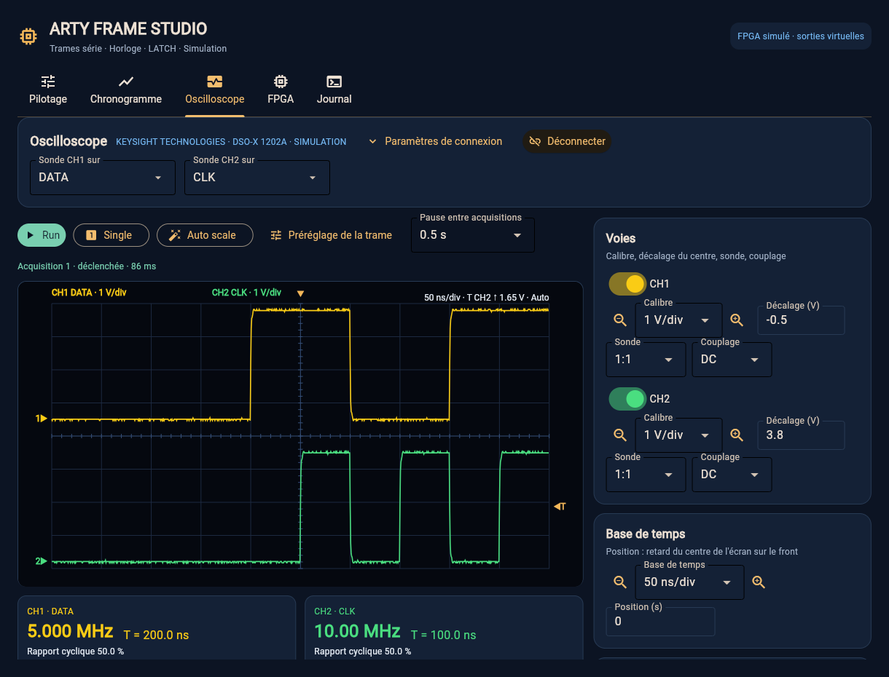

# Oscilloscope : visualiser et mesurer DATA, CLK et LATCH

L'onglet **Oscilloscope** affiche jusqu'à **deux voies** d'un oscilloscope
**Keysight InfiniiVision**, avec un pilote basé sur le guide officiel
**1200 X-Series du DSOX1202A** et vérifié en simulation. Les autres séries
InfiniiVision partagent de nombreuses commandes ; leur compatibilité avec cet
onglet reste à vérifier sur chaque appareil. L'onglet reprend les fonctions
utiles pour valider la carte sans quitter l'application :
mesure de **fréquence et période**, **déclenchement**, **calibres et Auto
scale**, **rafraîchissement continu** et **curseurs**.

Sans appareil, le choix **Simulation (démo)** montre les signaux de la trame
décrite dans le Pilotage, avec des niveaux 0/3,3 V et des fronts et du bruit
illustratifs. Il permet de découvrir l'onglet et de préparer les réglages ; il
ne mesure ni la carte ni les sondes branchées.



## 1. Relier l'oscilloscope au PC

| Liaison | Préparation | Dans l'application |
| --- | --- | --- |
| **LAN** (recommandé sans droits administrateur) | Vérifier la prise **LAN/RJ45 arrière** de votre appareil ; câble Ethernet sur le même réseau que le PC. Lire l'adresse dans **Utility → I/O → Configure → LAN → LAN Settings**. | **Keysight · réseau LAN**, saisir l'adresse IP, **Connecter**. Aucun pilote VISA à installer : SCPI sur le port TCP **5025**. |
| **USB** | Câble USB entre le port **USB Device arrière** de l'oscilloscope et le PC ; pilote USBTMC et bibliothèque VISA déjà installés, par exemple **Keysight IO Libraries Suite**. | **Keysight · USB / VISA**, cliquer sur la loupe **Rechercher**, choisir la ressource `USB0::0x2A8D::…::INSTR`, **Connecter**. |
| **Démo** | Rien. | **Simulation (démo)**, **Connecter**. |

La fiche Keysight actuelle donne un **LAN standard** au DSOX1202A : aucun
module supplémentaire n'est indiqué. Vérifier les connecteurs de votre
exemplaire avant de choisir la liaison. Le PC se branche sur **USB Device**,
jamais sur le port USB Host destiné aux clés USB.

PyVISA est installé avec l'application ; il ne remplace pas le pilote USB ni
la bibliothèque VISA du fabricant. L'installation de Keysight IO Libraries
Suite demande des droits administrateur. Si votre compte ne les possède pas,
utiliser le LAN ou une installation VISA existante. Après une mise à jour,
le lanceur
`start-windows.cmd` complète automatiquement l'installation au démarrage
suivant ; `start-windows.cmd --setup-only` le fait sans lancer l'interface.
L'application retient le dernier oscilloscope utilisé
(`profiles/oscilloscope.json`).

## 2. Brancher les sondes

Les sorties de l'Arty sont des signaux **3,3 V** sur le Pmod **JB** avec le
firmware de référence :

| Voie | Signal | Pointe | Masse |
| --- | --- | --- | --- |
| CH1 (jaune) | DATA | JB1 | JB5 ou JB11 |
| CH2 (vert) | CLK | JB2 | JB5 ou JB11 |
| au choix | LATCH | JB3 | JB5 ou JB11 |

Dans l'application, **Sonde CH1 sur / Sonde CH2 sur** indique ce que chaque
voie observe : les titres, le préréglage et les contrôles de cohérence s'en
servent. Un firmware personnalisé utilise les broches de sa configuration.

Pour des fronts à 10 MHz :

1. **Sonde en ×10** (commutateur sur ×10 si la sonde en a un) : la **N2140A**
   fournie avec le DSOX1202A est spécifiée à **6 MHz en ×1**, **200 MHz en ×10**.
   En ×1, elle atténue et arrondit fortement une CLK à 10 MHz. Pour une autre
   sonde, lire ses spécifications plutôt que généraliser cette limite.
2. **Même facteur dans la voie** : régler **Sonde 10:1** dans l'application
   (ou sur l'oscilloscope). Un facteur différent multiplie ou divise toutes les
   tensions par 10 : une sortie de 3,3 V apparaît vers **33 V** ou **0,33 V**.
3. **Ressort de masse court** plutôt que la pince crocodile : le long fil de
   masse peut ajouter des pics et de l'oscillation aux fronts. Compenser aussi
   la sonde sur la sortie de calibration de l'oscilloscope avant la mesure.

Une lecture de **66 V crête à crête à 20 V/div** sur une sortie nominale de
3,3 V exige de vérifier la mesure. Un facteur de sonde incohérent, une masse
longue, une compensation incorrecte ou le câblage sont des pistes à contrôler.
Un facteur ×10 seul ferait apparaître environ **33 V** pour un signal 0/3,3 V ;
66 V ne prouve donc pas cette cause. Les messages de l'onglet signalent des
indices à vérifier, sans identifier automatiquement la cause physique.

## 3. Organisation de l'onglet

- **En haut — Oscilloscope** : liaison, adresse, connexion et affectation des
  voies. Une fois connecté, l'identité de l'appareil s'affiche et les détails
  se replient. **Paramètres de connexion** les réaffiche ; les associations
  CH1/CH2 et **Déconnecter** restent accessibles.
- **Barre d'acquisition** : **Run / Stop** (vert pour lancer, rouge pendant
  les acquisitions répétées), **Single**, **Auto scale**, **Préréglage de la
  trame**, **Pause entre acquisitions** (0,2 à 5 s) et état de la dernière
  acquisition.
- **Écran** : 10 × 8 divisions. CH1 en jaune, CH2 en vert ; repères de masse
  `1▶` et `2▶` à gauche, niveau de déclenchement `◀T` à droite, instant de
  déclenchement `▼` en haut. Le calibre, la base de temps et le
  déclenchement sont rappelés en haut de l'écran.
- **Mesures** : sous l'écran, une carte par voie avec la **fréquence** en grand,
  la **période** `T = …`, le rapport cyclique, Vpp, minimum et maximum.
- **Colonne de réglages** (à droite sur grand écran, dessous sur petite
  fenêtre) : Voies, Base de temps, Déclenchement, Curseurs, Exporter.

## 4. Mesurer une fréquence ou une période d'horloge

1. Connecter, puis cliquer sur **Préréglage de la trame** : 1 V/div sur les
   deux voies, DATA en haut et CLK en bas de l'écran, base de temps couvrant
   **cinq périodes** de la CLK du Pilotage, déclenchement **CLK, front
   montant, 1,65 V, Auto**. Le facteur de sonde de chaque voie est conservé.
   **Auto scale** convient aussi pour un signal inconnu.
2. Cliquer sur **Single** pour une acquisition, ou **Run** pour un
   rafraîchissement continu à la cadence choisie.
3. Lire la carte de mesure de la voie CLK : **fréquence** et **période**.
   « Mesuré par l'oscilloscope » signifie que les valeurs viennent des
   mesures de l'appareil. Sur le DSOX1202A, fréquence et période portent sur le
   **cycle visible le plus proche de la référence de déclenchement**. Sinon,
   l'application les estime à partir des points relus.

Les mesures locales utilisent les niveaux bas et haut du signal (centiles 5 et
95 %), des croisements au mi-niveau avec hystérésis et une interpolation entre
points. La période est la moyenne des intervalles entre fronts montants
consécutifs, en ignorant les trous : une **CLK en rafales** (CLK libre
désactivée) donne donc bien la période de ses impulsions. Si l'oscilloscope
mesure une autre valeur, la carte affiche aussi « Fronts à l'écran : … ».
Pour l'estimation locale, un écart inférieur à une demi-division ne compte
pas comme un front. Une voie non raccordée ou bruyante ne permet pas de
valider une fréquence, même si l'appareil affiche une valeur.

**DATA n'est pas une horloge** : avec des bits alternés `1010…` à 10 MHz, DATA
change tous les 100 ns et sa « fréquence » vaut **5 MHz** (période 200 ns).
Pour des données irrégulières, cette mesure dépend du motif visible et ne
permet pas à elle seule de déduire CLK. Mesurer CLK pour connaître la cadence
des bits ; la cadence de répétition des trames se mesure sur LATCH.

## 5. Déclenchement, calibres et rafraîchissement

- **Déclenchement** : source CH1 ou CH2, front montant ou descendant, niveau en
  volts (`1.65`, `1,65` ou `500m` sont acceptés), bouton **50 %** pour placer le
  niveau au milieu du signal de la source. Mode **Auto** : l'application peut
  forcer l'acquisition sans front et l'indique dans son état. Mode **Normal** :
  elle attend un front ; sans front avant le délai, l'écran garde la dernière
  trace et indique « En attente de déclenchement ».
- **Calibres** : liste 1-2-5 de 1 mV/div à 100 V/div, entourée de loupes
  (**dézoomer / zoomer** d'un cran, comme un bouton rotatif). **Décalage** : tension
  au centre de l'écran. **Couplage** DC ou AC.
- **Base de temps** : de 2 ns/div à 5 s/div, avec les mêmes loupes.
  **Position** : retard du centre de l'écran sur le déclenchement (`100n`,
  `-2u`, `0`…).
- **Run / Stop / Single** : l'application commande des acquisitions uniques
  (SINGLE) et les relit ; **Run** les enchaîne à la cadence de
  **Rafraîchissement**. Sur le DSOX1202A, SINGLE attend un front même si le
  déclenchement est en Auto ; l'application utilise **Force Trigger** après une courte
  attente dans ce mode pour permettre la lecture d'un niveau continu. Une
  modification faite sur la face avant est reprise à
  l'acquisition suivante. À la déconnexion ou à la fermeture, l'oscilloscope
  reprend son acquisition normale (RUN).

## 6. Curseurs

Choisir **Temps (X)**, **Tension (Y)** ou **Temps et tension**, puis :

- glisser les curseurs **X1, X2, Y1, Y2** avec les curseurs de réglage ;
- ou **cliquer / glisser sur l'écran** : le curseur le plus proche suit le
  pointeur ;
- **Mesurer une période** place X1 et X2 sur deux fronts montants consécutifs
  (CLK de préférence), au plus près du déclenchement.

La lecture donne X1, X2, **ΔX** et **1/ΔX** (fréquence), ainsi que Y1, Y2 et **ΔY**
sur la voie choisie. Les instants sont comptés depuis le déclenchement.

## 7. Exporter

- **Exporter CSV** : points de la dernière acquisition, colonnes temps (s) et
  tension (V) par voie, dans `exports/oscilloscope-AAAAMMJJ-HHMMSS.csv`.
- **Copie d'écran PNG** : image de l'écran de l'oscilloscope réel, dans le même
  dossier (indisponible en démonstration).

## 8. Ligne de commande

```bash
arty-frame scope-list                                   # ressources VISA (USB, LAN)
arty-frame scope --lan 192.168.1.50 --preset            # réglages de la trame puis mesure
arty-frame scope --visa USB0::0x2A8D::0x1797::CN12345678::0::INSTR --autoscale \
    --csv exports/mesure.csv --png exports/ecran.png
arty-frame scope --demo --profile examples/frame_sipo_8bits_10mhz.json
```

La commande affiche la fréquence, la période, Vpp et le rapport cyclique de
chaque voie affichée. Pour USB, remplacer l'adresse d'exemple par la ressource
réelle donnée par `scope-list` : identifiants et numéro de série varient.
Les associations `--ch1 data --ch2 clk` sont celles par défaut. Si les câbles
sont inversés, utiliser `--ch1 clk --ch2 data` ; cela change l'interprétation
et le préréglage, pas le câblage. Le délai `--timeout` doit être compris entre
0 exclus et 60 secondes inclus.

## 9. Limites

- Dans l'interface, l'attente par acquisition est de 2 secondes. Une base de
  temps très lente peut empêcher la capture de se terminer dans ce délai,
  même après un déclenchement. Réduire la base de temps ou utiliser la CLI
  avec un `--timeout` plus grand (au plus 60 secondes).
- Deux voies, déclenchement sur front uniquement, **jusqu'à 1000 points
  visibles** relus par voie en mode de transfert NORMal. Ces points ne sont pas
  la mémoire brute complète de l'oscilloscope. Les estimations locales perdent
  en précision si la fenêtre contient trop de périodes.
- Le préréglage et les réglages horizontaux utilisent le **centre** de l'écran.
- La cadence réelle dépend de la liaison, de la fenêtre de temps, du
  déclenchement et de l'appareil ; elle n'a pas été mesurée sur un DSOX1202A réel.
- Le pilote a été validé avec un **oscilloscope simulé** au niveau des
  commandes SCPI et avec des transports simulés (LAN et VISA). La première
  utilisation avec le DSOX1202A doit être vérifiée : en cas d'écart, le journal
  donne la commande refusée et le message de l'appareil.

Le DSOX1202A dispose de **70 MHz de bande passante de base**, ou 100/200 MHz
avec l'option correspondante, et d'un échantillonnage maximal de **2 GSa/s**
(1 GSa/s si la voie External Trig est affichée). Une CLK à **200 MHz** a une
période de 5 ns : même avec l'option 200 MHz, la fondamentale arrive à la
limite de bande passante et les harmoniques qui dessinent les fronts sont
atténuées. Une fréquence lisible ne valide donc pas les temps de montée,
les dépassements ni les marges DATA/CLK à cette cadence. Commencer à 1 MHz,
puis 10 MHz, et utiliser une chaîne de mesure adaptée aux fronts à vérifier.

## 10. Résoudre les difficultés

| Observation | Action |
| --- | --- |
| « Aucun instrument VISA trouvé » | Vérifier le câble sur le port USB **Device arrière** et la VISA existante (Connection Expert doit voir l'appareil). PyVISA seul ne suffit pas ; sans droits d'installation, utiliser le LAN. |
| « Oscilloscope injoignable sur … :5025 » | Vérifier la prise LAN, l'adresse IP (Utility → I/O → Configure → LAN), que le PC est sur le même réseau et que le port 5025 est accessible. |
| « PyVISA est absent » | Relancer `start-windows.cmd --setup-only`. |
| Base de temps ou déclenchement non pris en charge | Sur l'appareil, choisir le mode horizontal **Main** et un déclenchement **Edge** sur CH1 ou CH2, puis reconnecter. XY, Roll, Zoom, External et les fronts alternés ne sont pas pilotés par cette interface. |
| « En attente de déclenchement (mode Normal) » | Vérifier la source et le niveau, cliquer sur **50 %** ou passer en **Auto**. |
| Fréquence « — » | Moins de deux fronts à l'écran : augmenter la base de temps ou utiliser **Préréglage de la trame**. |
| Tensions ×10 ou ÷10 | Accorder le commutateur de la sonde (×1 / ×10) et le réglage **Sonde** de la voie. |
| Pics ou oscillations à chaque front | Utiliser le ressort de masse court de la sonde, au plus près de JB5/JB11. |
| « Délai dépassé en attendant l'oscilloscope » | La session qui ne répond plus est fermée pour éviter de réutiliser une réponse tardive. Rétablir la liaison puis cliquer sur **Connecter**. Ce cas diffère d'une simple attente de déclenchement en mode Normal. |

## 11. Documents Keysight du DSOX1202A

- [Fiche technique InfiniiVision 1000 X-Series](https://www.keysight.com/content/dam/keysight/en/doc/ungate/data-sheets/5992-3484.pdf),
  p. 2 et 9 : USB et LAN standard ; p. 12 : bande passante et échantillonnage.
- [Guide utilisateur 1200 X-Series et EDUX1052A/G](https://www.keysight.com/content/dam/keysight/en/doc/gate/user-manuals/9018-70020.pdf),
  p. 34 : connecteurs ; p. 130 : acquisition Single ; p. 233–236 : interfaces.
- [Guide de programmation 1200 X-Series et EDUX1052A/G](https://www.keysight.com/content/dam/keysight/en/doc/gate/programming-guides/9018-07747.pdf),
  p. 53 : TCP 5025 ; p. 380 et 388 : fréquence/période ; p. 675–677 : points
  visibles et mode NORMal ; p. 820–823 : attente d'acquisition avec délai.
- [Guide des sondes N2140A/N2142A](https://www.keysight.com/us/en/assets/9018-04462/quick-start-guides/9018-04462.pdf),
  p. 2, tableau 2 : bande passante et charge de la sonde selon ×1/×10.
- [Installation Keysight IO Libraries Suite 2025](https://www.keysight.com/us/content/lib/software-detail/computer-software/io-libraries-suite-downloads-2175637/keysight-io-libraries-suite-2025.html) :
  droits administrateur requis pour l'installation Windows.
