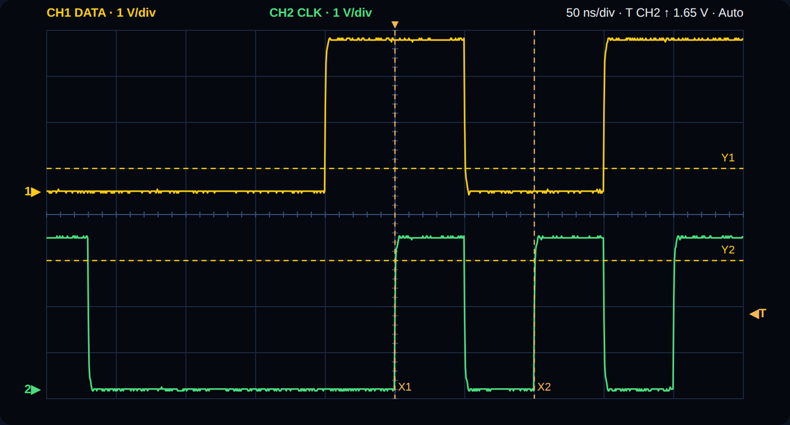

# Oscilloscope : visualiser et mesurer DATA, CLK et LATCH

L'onglet **Oscilloscope** affiche jusqu'à **deux voies** d'un oscilloscope
**Keysight InfiniiVision** (testé en simulation sur le modèle du **DSOX1202A** ;
les séries 1000, 2000, 3000 et 4000 X utilisent les mêmes commandes SCPI). Il
reprend les fonctions utiles pour valider la carte sans quitter l'application :
mesure de **fréquence et période**, **déclenchement**, **calibres et Auto
scale**, **rafraîchissement continu** et **curseurs**.

Sans appareil, le choix **Simulation (démo)** montre les signaux de la trame
décrite dans le Pilotage, avec des fronts LVCMOS 3,3 V réalistes et du bruit.
Il permet de découvrir l'onglet et de préparer les réglages.



## 1. Relier l'oscilloscope au PC

| Liaison | Préparation | Dans l'application |
| --- | --- | --- |
| **LAN** (recommandé) | Câble Ethernet sur le même réseau que le PC. L'adresse se lit sur l'oscilloscope : **Utility → I/O → LAN**. | **Keysight · réseau LAN**, saisir l'adresse IP, **Connecter**. Aucun logiciel à installer : SCPI sur le port TCP **5025**. |
| **USB** | Câble USB entre le port **USB Device arrière** de l'oscilloscope et le PC. Installer **Keysight IO Libraries Suite** (gratuit), qui fournit le pilote USBTMC et VISA. | **Keysight · USB / VISA**, cliquer sur la loupe **Rechercher**, choisir la ressource `USB0::0x2A8D::…::INSTR`, **Connecter**. |
| **Démo** | Rien. | **Simulation (démo)**, **Connecter**. |

PyVISA est installé avec l'application. Après une mise à jour, le lanceur
`start-windows.cmd` complète automatiquement l'installation au démarrage
suivant ; `start-windows.cmd --setup-only` le fait sans lancer l'interface.
L'application retient le dernier oscilloscope utilisé
(`profiles/oscilloscope.json`).

## 2. Brancher les sondes

Les sorties de l'Arty sont des signaux **3,3 V** sur le Pmod **JB** avec le
firmware de référence :

| Voie | Signal | Pointe | Masse |
| --- | --- | --- | --- |
| CH1 (jaune) | DATA | JB1 | JB5 ou JB11 |
| CH2 (vert) | CLK | JB2 | JB5 ou JB11 |
| au choix | LATCH | JB3 | JB5 ou JB11 |

Dans l'application, **Sonde CH1 sur / Sonde CH2 sur** indique ce que chaque
voie observe : les titres, le préréglage et les contrôles de cohérence s'en
servent. Un firmware personnalisé utilise les broches de sa configuration.

Pour des fronts à 10 MHz :

1. **Sonde en ×10** (commutateur sur ×10 si la sonde en a un) : en ×1, une sonde
   passive n'a qu'une bande passante de quelques MHz et arrondit les fronts
   d'une CLK à 10 MHz.
2. **Même facteur dans la voie** : régler **Sonde 10:1** dans l'application
   (ou sur l'oscilloscope). Un facteur différent multiplie ou divise toutes les
   tensions par 10 : une sortie de 3,3 V apparaît vers **33 V** ou **0,33 V**.
3. **Ressort de masse court** plutôt que la pince crocodile : le long fil de
   masse forme une boucle qui produit les pics et l'oscillation visibles sur
   chaque front.

La capture de référence (DSOX1202A, DATA sur CH1) montrait **66 V crête à crête
à 20 V/div** pour une sortie de 3,3 V : niveaux multipliés par 10 (facteur de
sonde différent entre la sonde et la voie) et pics aux fronts (masse longue).
L'onglet signale ces deux situations sous les mesures.

## 3. Organisation de l'onglet

- **En haut — Oscilloscope** : liaison, adresse, connexion et affectation des
  voies. Une fois connecté, l'identité de l'appareil s'affiche.
- **Barre d'acquisition** : **Run / Stop** (vert pour lancer, rouge pendant
  l'acquisition continue), **Single**, **Auto scale**, **Préréglage de la
  trame**, cadence de **Rafraîchissement** (0,2 à 5 s) et état de la dernière
  acquisition.
- **Écran** : 10 × 8 divisions. CH1 en jaune, CH2 en vert ; repères de masse
  `1▶` et `2▶` à gauche, niveau de déclenchement `◀T` à droite, instant de
  déclenchement `▼` en haut. Le calibre, la base de temps et le
  déclenchement sont rappelés en haut de l'écran.
- **Mesures** : sous l'écran, une carte par voie avec la **fréquence** en grand,
  la **période** `T = …`, le rapport cyclique, Vpp, minimum et maximum.
- **Colonne de réglages** (à droite sur grand écran, dessous sur petite
  fenêtre) : Voies, Base de temps, Déclenchement, Curseurs, Exporter.

## 4. Mesurer une fréquence ou une période d'horloge

1. Connecter, puis cliquer sur **Préréglage de la trame** : 1 V/div sur les
   deux voies, DATA en haut et CLK en bas de l'écran, base de temps couvrant
   **cinq périodes** de la CLK du Pilotage, déclenchement **CLK, front
   montant, 1,65 V, Auto**. Le facteur de sonde de chaque voie est conservé.
   **Auto scale** convient aussi pour un signal inconnu.
2. Cliquer sur **Single** pour une acquisition, ou **Run** pour un
   rafraîchissement continu à la cadence choisie.
3. Lire la carte de mesure de la voie CLK : **fréquence** et **période**.
   « Mesuré par l'oscilloscope » signifie que les valeurs viennent des
   mesures de l'appareil, sur tout son enregistrement. Sinon, l'application
   les calcule sur les points affichés.

Les mesures locales utilisent les niveaux bas et haut du signal (centiles 5 et
95 %), des croisements au mi-niveau avec hystérésis et une interpolation entre
points. La période est la moyenne des intervalles entre fronts montants
consécutifs, en ignorant les trous : une **CLK en rafales** (CLK libre
désactivée) donne donc bien la période de ses impulsions. Si l'oscilloscope
mesure une autre valeur, la carte affiche aussi « Fronts à l'écran : … ».
Un écart inférieur à une demi-division ne compte pas comme un front : une voie
non raccordée n'affiche pas de fréquence.

**DATA n'est pas une horloge** : avec des bits alternés `1010…` à 10 MHz, DATA
change tous les 100 ns et sa « fréquence » vaut **5 MHz** (période 200 ns),
comme sur la capture de référence. Pour la fréquence de la trame, mesurer CLK.

## 5. Déclenchement, calibres et rafraîchissement

- **Déclenchement** : source CH1 ou CH2, front montant ou descendant, niveau en
  volts (`1.65`, `1,65` ou `500m` sont acceptés), bouton **50 %** pour placer le
  niveau au milieu du signal de la source. Mode **Auto** : l'oscilloscope
  acquiert même sans front. Mode **Normal** : il attend un front ; sans front,
  l'écran garde la dernière trace et indique « En attente de déclenchement ».
- **Calibres** : liste 1-2-5 de 1 mV/div à 100 V/div, entourée de loupes
  (**dézoomer / zoomer** d'un cran, comme un bouton rotatif). **Décalage** : tension
  au centre de l'écran. **Couplage** DC ou AC.
- **Base de temps** : de 2 ns/div à 5 s/div, avec les mêmes loupes.
  **Position** : retard du centre de l'écran sur le déclenchement (`100n`,
  `-2u`, `0`…).
- **Run / Stop / Single** : l'application commande des acquisitions uniques
  (SINGLE) et les relit ; **Run** les enchaîne à la cadence de
  **Rafraîchissement**. Une modification faite sur la face avant est reprise à
  l'acquisition suivante. À la déconnexion ou à la fermeture, l'oscilloscope
  reprend son acquisition normale (RUN).

## 6. Curseurs

Choisir **Temps (X)**, **Tension (Y)** ou **Temps et tension**, puis :

- glisser les curseurs **X1, X2, Y1, Y2** avec les curseurs de réglage ;
- ou **cliquer / glisser sur l'écran** : le curseur le plus proche suit le
  pointeur ;
- **Mesurer une période** place X1 et X2 sur deux fronts montants consécutifs
  (CLK de préférence), au plus près du déclenchement.

La lecture donne X1, X2, **ΔX** et **1/ΔX** (fréquence), ainsi que Y1, Y2 et **ΔY**
sur la voie choisie. Les instants sont comptés depuis le déclenchement.

## 7. Exporter

- **Exporter CSV** : points de la dernière acquisition, colonnes temps (s) et
  tension (V) par voie, dans `exports/oscilloscope-AAAAMMJJ-HHMMSS.csv`.
- **Copie d'écran PNG** : image de l'écran de l'oscilloscope réel, dans le même
  dossier (indisponible en démonstration).

## 8. Ligne de commande

```bash
arty-frame scope-list                                   # ressources VISA (USB, LAN)
arty-frame scope --lan 192.168.1.50 --preset            # réglages de la trame puis mesure
arty-frame scope --visa USB0::0x2A8D::0x0396::CN12345678::0::INSTR --autoscale \
    --csv exports/mesure.csv --png exports/ecran.png
arty-frame scope --demo --profile examples/frame_sipo_8bits_10mhz.json
```

La commande affiche la fréquence, la période, Vpp et le rapport cyclique de
chaque voie affichée.

## 9. Limites

- Deux voies, déclenchement sur front uniquement, 1000 points relus par
  acquisition (les mesures de l'oscilloscope portent sur son enregistrement
  complet).
- L'application règle la référence horizontale au **centre** de l'écran.
- La cadence réelle dépend de la liaison et de l'appareil : en USB ou LAN,
  compter quelques dizaines de millisecondes par acquisition.
- Le pilote a été validé avec un **oscilloscope simulé** au niveau des
  commandes SCPI et avec des transports simulés (LAN et VISA). La première
  utilisation avec le DSOX1202A doit être vérifiée : en cas d'écart, le journal
  donne la commande refusée et le message de l'appareil.

## 10. Résoudre les difficultés

| Observation | Action |
| --- | --- |
| « Aucun instrument VISA trouvé » | Vérifier le câble sur le port USB **arrière** et l'installation de Keysight IO Libraries Suite (Connection Expert doit voir l'appareil), ou passer en LAN. |
| « Oscilloscope injoignable sur … :5025 » | Vérifier l'adresse IP (Utility → I/O → LAN), que le PC est sur le même réseau et qu'un pare-feu ne bloque pas le port 5025. |
| « PyVISA est absent » | Relancer `start-windows.cmd --setup-only`. |
| « En attente de déclenchement (mode Normal) » | Vérifier la source et le niveau, cliquer sur **50 %** ou passer en **Auto**. |
| Fréquence « — » | Moins de deux fronts à l'écran : augmenter la base de temps ou utiliser **Préréglage de la trame**. |
| Tensions ×10 ou ÷10 | Accorder le commutateur de la sonde (×1 / ×10) et le réglage **Sonde** de la voie. |
| Pics ou oscillations à chaque front | Utiliser le ressort de masse court de la sonde, au plus près de JB5/JB11. |
| « Délai dépassé en attendant l'oscilloscope » | La liaison ne répond plus : Déconnecter puis Connecter. L'application jette les réponses tardives avant de continuer. |
